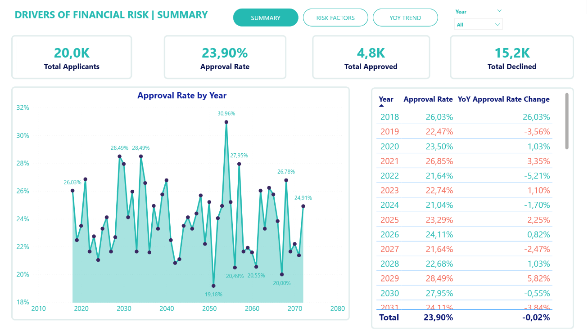
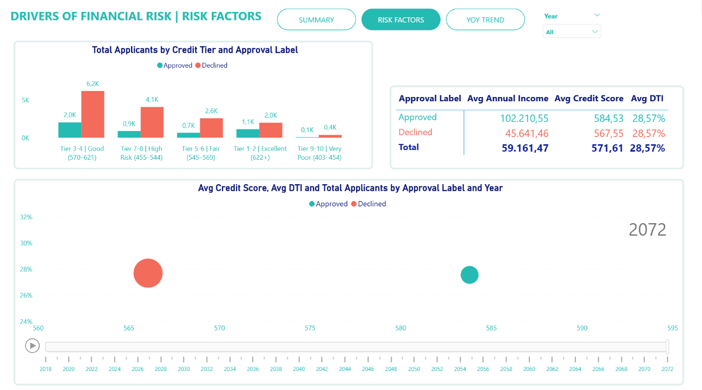
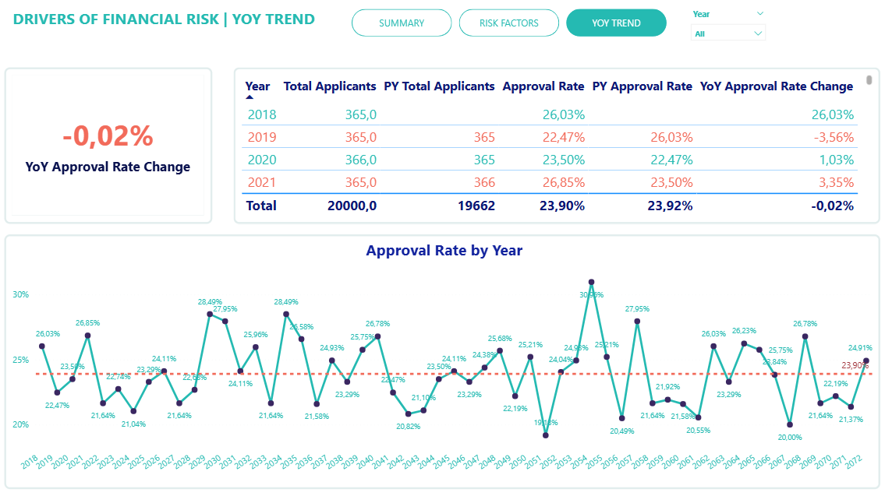

# 📊 Drivers of Financial Risk | SQL + Power BI

---

## 1. Project Overview

**76% of loan applications were declined, but what actually determines the outcome?**

This project analyzed 20,000 loan applications to identify the key financial factors that genuinely distinguish approved applicants from declined ones. The analysis reveals that income has a far stronger influence on approval decisions than credit score, while the debt-to-income ratio, commonly regarded as a critical indicator, shows no meaningful difference between the two groups.

Lending institutions regularly decline a large volume of loan applications, yet the criteria behind those decisions are often unclear. Without a clear understanding of which financial signals actually drive approvals, lenders face two major risks at the same time: approving high-risk borrowers while also declining applicants who are fully capable of repayment.

Using MySQL for data aggregation and a three-page interactive Power BI dashboard, this project delivers clear insights into approval patterns across years, credit risk tiers, and loan approval outcomes, along with data-driven recommendations for improving lending policy based on actual evidence rather than conventional assumptions.

---

## 2. Objectives

- Identify which financial variables (income, credit score, debt-to-income ratio, assets, liabilities, savings, and job tenure) most clearly distinguish approved applicants from declined ones
- Quantify the approval gap across five credit risk tiers (Excellent down to Very Poor) to determine whether credit score alone is sufficient to predict loan outcomes
- Track changes in loan approval rate year by year (2018 to 2072) to detect policy shifts or cyclical patterns
- Build a three-page interactive Power BI dashboard with filters by Year, Credit Risk Tier, and Loan Approval Outcome
- Document data quality issues (for example, the identical debt-to-income ratio across both groups) that require investigation before the model can be trusted for policy decisions

---

## 3. Project Scope & Tools

| Component | Details |
|----------|----------|
| **Dataset** | 20,000 loan applications, stored in 1 table named `loan` with 36 columns |
| **Data source** | Synthetic dataset from Kaggle, simulating credit behavior rather than reflecting real-world data |
| **Data period** | 2018 to 2072 |
| **SQL** | MySQL, covering GROUP BY year combined with approval status, average calculations for financial indicators, and credit risk tier classification |
| **Visualization** | Power BI Desktop, with 3 pages: Summary, Risk Factors, and YoY Trend |
| **DAX** | Approval Rate, PY Approval Rate, and YoY Approval Rate Change |
| **Output files** | `.sql`, `.csv`, and `.pdf` (dashboard export) |

---

## 4. Repository Structure

```
drivers-of-financial-risk/
├── queries/
│   └── loan_analysis.sql        # Analysis by year combined with approval status, plus credit risk tier classification
├── data/
│   └── raw/
│       └── Loan.csv             # Original dataset (20,000 records, 36 columns)
├── reports/
│   └── Drivers_of_financial_risk.pdf  # Power BI dashboard export (3 pages)
├── visuals/
│   ├── summary_page.png
│   ├── risk_factors_page.png
│   └── yoy_trend_page.png
└── README.md
```

---

## 5. Data Workflow

```text
Raw Data
└── Loan.csv (20,000 records × 36 columns, Kaggle synthetic dataset)
        │
        ▼
[MySQL — loan_analysis.sql]
    Query 1: GROUP BY year combined with approval status, computing averages for income, assets, debt-to-income ratio, and other indicators
    Query 2: CASE WHEN CreditScore → Credit Risk Tier (5 groups)
        │
        ▼
[Power BI — Import & Model]
    Create Approval Label column
    Calculate DAX measures: Approval Rate, PY Approval Rate, YoY Change
        │
        ▼
[Power BI — Dashboard]
    Page 1: Summary (KPI cards and loan approval rate by year)
    Page 2: Risk Factors (credit risk tier analysis and comparison between approved and declined applicants)
    Page 3: YoY Trend (year-by-year table and trend line against the overall average)
    Filters: Year slicer, Credit Risk Tier, Loan Approval Outcome
```

---

## 6. Data Model & Schema

**Single table:** `yt_data.loan`, with no joins and no ERD

| Column | Type | Description |
|-----|------|-------|
| `ApplicationDate` | DATE | Date the loan application was submitted |
| `Age` | INT | Applicant age |
| `AnnualIncome` | INT | Annual income (USD) |
| `CreditScore` | INT | Credit score (403 to 750 and above) |
| `EmploymentStatus` | VARCHAR | Employment status |
| `EducationLevel` | VARCHAR | Education level |
| `LoanAmount` | INT | Loan amount requested (USD) |
| `LoanDuration` | INT | Loan term (months) |
| `DebtToIncomeRatio` | FLOAT | Debt-to-income ratio for the current loan only |
| `TotalDebtToIncomeRatio` | FLOAT | Total debt-to-income ratio across all existing debts |
| `BankruptcyHistory` | INT | Bankruptcy history (0 = No, 1 = Yes) |
| `PreviousLoanDefaults` | INT | Number of previous loan repayment failures |
| `SavingsAccountBalance` | INT | Savings account balance (USD) |
| `TotalAssets` | INT | Total assets (USD) |
| `TotalLiabilities` | INT | Total liabilities (USD) |
| `JobTenure` | INT | Years employed at current company |
| `NetWorth` | INT | Net worth (USD) |
| `RiskScore` | FLOAT | System-calculated risk score |
| `LoanApproved` | INT | Loan approval outcome (1 = Approved, 0 = Declined) |

---

## 7. Analysis & Metrics

### Key Metrics

| Metric | Value | Notes |
|--------|---------|---------|
| Total Applicants | 20,000 | Total applications in the dataset |
| Approval Rate | 23.90% | Roughly 1 in 4 applications is approved |
| Total Approved | 4,800 | |
| Total Declined | 15,200 | |
| YoY Approval Rate Change (avg) | −0.02% | Nearly flat, with no clear directional trend |

### Approved vs. Declined — Financial Indicator Comparison

| Indicator | Approved | Declined | Difference |
|--------|----------|----------|-----------|
| Avg Annual Income | $102,211 | $45,641 | **+$56,570** |
| Avg Credit Score | 584.53 | 567.55 | +16.98 points |
| Avg Debt-to-Income Ratio | 28.57% | 28.57% | **0, with no difference between groups** |

### Credit Risk Tier Classification & Approval Count

| Tier | Credit Score | Approved | Declined | Approval Rate (estimated) |
|------|-------------|----------|----------|--------------------------|
| Tier 1-2 (Excellent) | 622 and above | 1,100 | 2,000 | ~35% |
| Tier 3-4 (Good) | 570–621 | 2,000 | 6,200 | ~24% |
| Tier 5-6 (Fair) | 545–569 | 700 | 4,100 | ~15% |
| Tier 7-8 (High Risk) | 455–544 | 900 | 2,600 | ~26% |
| Tier 9-10 (Very Poor) | 403–454 | 100 | 400 | ~20% |

### SQL — Query 1: Analysis by Year and Approval Status

```sql
SELECT
    DATE_FORMAT(ApplicationDate, '%Y') AS _year,
    CASE
        WHEN LoanApproved = 1 THEN 'Approved'
        ELSE 'Declined'
    END AS approval_status,
    COUNT(*) AS total_applicants,
    ROUND(AVG(Age), 2) AS avg_age,
    ROUND(AVG(AnnualIncome), 2) AS avg_income,
    ROUND(AVG(TotalAssets), 2) AS avg_assets,
    ROUND(AVG(TotalLiabilities), 2) AS avg_liabilities,
    ROUND(AVG(SavingsAccountBalance), 2) AS avg_savingsaccountbalance,
    ROUND(AVG(JobTenure), 2) AS avg_jobtenure,
    ROUND(AVG(TotalDebtToIncomeRatio), 2) AS avg_debttoincomeratio
FROM yt_data.loan
GROUP BY 1, 2
ORDER BY 1;
```

*Produces a comparison table of financial indicators by year and approval status, serving as the primary input for the Risk Factors and YoY Trend pages in Power BI.*

### SQL — Query 2: Credit Risk Tier Classification

```sql
SELECT
    CASE
        WHEN CreditScore >= 622 THEN 'Tier 1-2 | Excellent'
        WHEN CreditScore BETWEEN 570 AND 621 THEN 'Tier 3-4 | Good'
        WHEN CreditScore BETWEEN 545 AND 569 THEN 'Tier 5-6 | Fair'
        WHEN CreditScore BETWEEN 455 AND 544 THEN 'Tier 7-8 | High Risk'
        ELSE 'Tier 9-10 | Very Poor'
    END AS credit_tier,
    SUM(LoanApproved) AS total_approved,
    COUNT(*) - SUM(LoanApproved) AS total_declined,
    ROUND(AVG(AnnualIncome), 2) AS avg_income,
    ROUND(AVG(CreditScore), 2) AS avg_credit_score
FROM yt_data.loan
GROUP BY 1
ORDER BY MIN(CreditScore) DESC;
```

*Groups applications into five credit risk tiers based on credit score, feeding the Risk Factors page in the dashboard.*

---

## 8. Key Insights

### 💰 Income is the strongest differentiating factor, not credit score

Approved applicants have an average annual income of $102,211, more than twice the average of declined applicants at $45,641. Meanwhile, the credit score gap is only 17 points (584 vs. 568), which is too small to explain an approval rate of just 23.9%. This suggests the approval model is prioritizing **repayment capacity based on income** over credit history. That may be a deliberate strategic choice, but it warrants closer examination before being treated as an optimal policy.

### 📉 The identical debt-to-income ratio across both groups is a signal that requires investigation, not a conclusion

The average debt-to-income ratio for both approved and declined applicants is exactly 28.57%, with no difference whatsoever. Debt-to-income ratio is widely regarded as a key credit assessment indicator, so this result is unusual and has two possible explanations: either the approval model genuinely does not use debt-to-income ratio as a filtering condition, or there is an issue with how `TotalDebtToIncomeRatio` is calculated in the dataset. This must be verified before drawing any conclusions about the role of debt-to-income ratio.

### 🏆 Even applicants in the Excellent credit tier (622 and above) are declined more often than they are approved

The Excellent tier (622 and above) has 1,100 approved applicants but 2,000 declined ones, giving an approval rate of only around 35% despite having the highest credit scores. This confirms that credit score is not a sufficient condition: applicants with a strong credit history but income below the threshold are still declined at a high rate. **Income matters more than credit risk tier.**

### 📊 Approval rate fluctuates significantly but shows no clear directional trend

The loan approval rate ranges from approximately 19% at its lowest to approximately 31% at its peak in 2055, with an average year-over-year change of just −0.02%. There is no sustained upward or downward trend. This may reflect cyclical credit policy changes or macroeconomic factors not captured in the current dataset.

### 📉 A 76.1% decline rate raises questions about creditworthy applicants who were incorrectly turned away

With 15,200 out of 20,000 applications declined, an important question is how many of those applicants were actually capable of repaying but were rejected due to income falling below the threshold. The current dataset does not include actual loan outcomes (whether borrowers repaid or defaulted), so it is not possible to evaluate the accuracy of the approval model.

---

## 9. Recommendations

**1. Re-examine the role of income in the approval model**

The $56K income gap between the two groups suggests that income is playing a dominant role in approval decisions. The Risk Management team should assess whether the current model is overlooking other positive signals, such as a clean repayment history, a high savings account balance, or long job tenure. The goal is to reduce the rate of creditworthy applicants incorrectly declined by 5 to 10% within the $40K to $70K income band with zero previous defaults, without increasing the loan repayment failure rate. *[Risk Management and Credit Policy team]*

**2. Investigate why debt-to-income ratio does not differentiate the two groups**

An average debt-to-income ratio of 28.57% in both groups is unusual and needs to be verified before this indicator is used in any model. The Data team should check how `TotalDebtToIncomeRatio` is calculated, whether any truncation or normalization was applied in the original dataset, and whether debt-to-income ratio is actually used in the approval logic at all. *[Data Engineering team]*

**3. Establish tier-specific lending policies rather than applying a single universal threshold**

Instead of one income threshold applied uniformly to all applicants, consider a tiered approach: Tier 1-2 (Excellent, 622 and above) could have a relaxed minimum income requirement given the lower credit risk, while Tier 7-8 (High Risk) should require collateral or a co-signer. Success would be measured by the approval rate for Excellent-tier applicants increasing from approximately 35% to approximately 45%, without a corresponding increase in loan repayment failures within that group. *[Credit Policy team]*

**4. Investigate the years with the most significant approval rate spikes**

The year 2055 has the highest approval rate at approximately 31%, while several years fall below 20%, a gap of 12 percentage points within the same dataset that is worth examining. Identifying the cause (internal policy changes, simulated economic conditions, or shifts in the application mix) would provide useful lessons for future planning cycles. *[Strategy and Planning team]*

---

## 10. Assumptions & Limitations

**Assumptions:**

- The dataset is synthetic and sourced from Kaggle. The patterns are generated by a simulation algorithm and may not fully reflect real-world credit market dynamics, particularly with regard to non-linear relationships between variables.
- `LoanApproved = 1` indicates an approved application and `= 0` indicates a declined one. There are no intermediate states such as pending, withdrawn, or conditional approval.
- The credit risk tier thresholds (622, 570, 545, 455, and 403) are defined for the purposes of this project and do not follow the official FICO scoring standard.

**Limitations:**

- **No actual loan outcome data available:** The dataset does not track whether approved borrowers successfully repaid their loans, so it is not possible to evaluate the quality of the approval model in terms of precision or recall against actual loan repayment failures.
- **SQL calculates averages only:** The current queries compute means only and do not reflect the actual distribution (including outliers and skew) of income, credit score, and other financial variables.
- **Debt-to-income ratio anomaly remains unexplained:** The identical ratio across both groups requires data quality verification before any conclusion can be drawn.
- **No geographic information available:** It is not possible to analyze results by region, state, or local market conditions.
- **Data extends to 2072:** The dataset simulates multiple decades into the future, which is not a real forecast. Patterns may not be consistent with actual credit behavior in practice.

---

## 11. Future Enhancements

- Add distribution analysis (histograms and boxplots) for income and credit score by tier to understand how outliers affect the averages
- Build a logistic regression model to predict `LoanApproved` and measure feature importance, to validate whether income is genuinely the top predictor
- Analyze repayment behavior by tier if additional outcome data becomes available (for example, loan repayment failure rate by tier)
- Add analysis by `EmploymentStatus` and `EducationLevel` to check for potential bias in the approval model

---

## 12. Deliverables

- ✅ `queries/loan_analysis.sql` — All queries: analysis by year combined with approval status, and credit risk tier classification
- ✅ Original dataset: `Loan.csv` (20,000 records, 36 columns), available at [Kaggle](https://www.kaggle.com/datasets/lorenzozoppelletto/financial-risk-for-loan-approval)
- ✅ `reports/Drivers_of_financial_risk.pdf` — Power BI dashboard export (3 pages)
- ✅ `README.md` — Full project documentation

---

## 13. Dashboard Preview

### Page 1 — Summary



### Page 2 — Risk Factors



### Page 3 — YoY Trend



---

## 14. Author

**Phan Ngoc Kim Thoa**

- 📧 thoaphan2921@gmail.com
- 💼 [LinkedIn](https://www.linkedin.com/in/thoangoc2906)
- 🐙 [GitHub](https://github.com/thoangoc2921)
